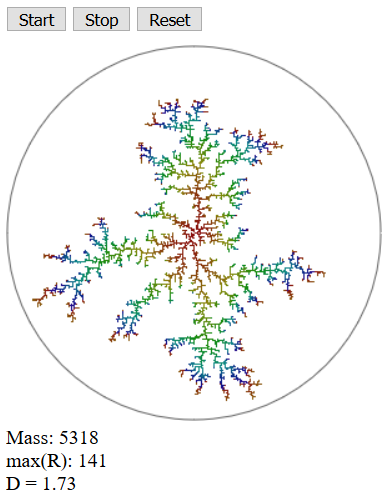

# Diffusion-limited aggregates in TypeScript

This is a rather simplistic implementation of a [diffusion-limited aggregate](https://en.wikipedia.org/wiki/Diffusion-limited_aggregation) that I wrote as an exercise in learning TypeScript.

To see it in action, clone this repo and open `dist/index.html` in a browser. You can also `yarn install && yarn run start` to build and run it as an express app.

### Sample output

